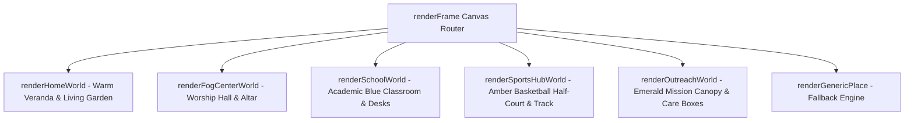
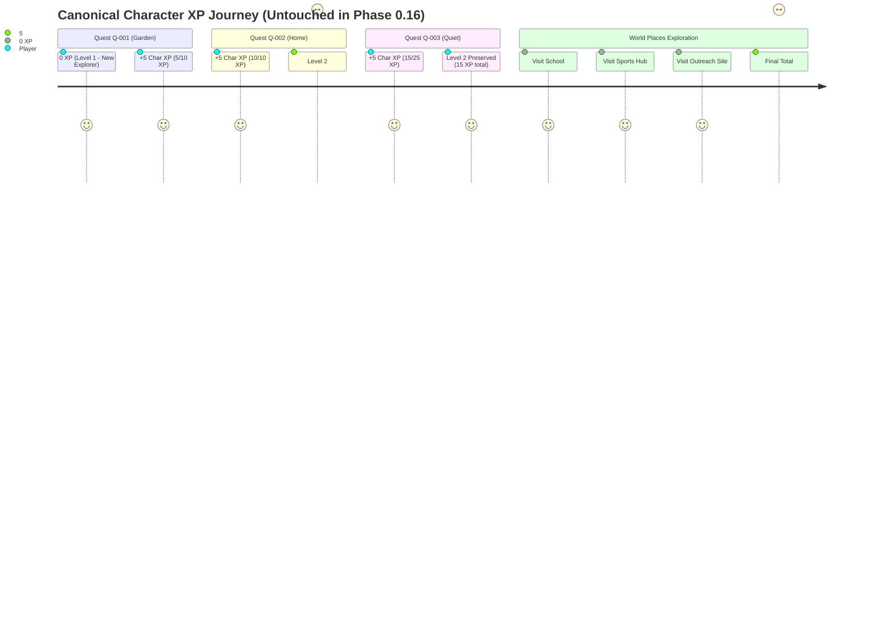

# KOINONIA — Phase 0.16 Verification & Results
## World & Places Expansion Engine (5 Playable Locations)

- **Workspace:** `/home/raspi4/koinonia-quest`
- **Branch:** `feature/koinonia-quest`
- **Base Prototype:** `prototype/koinonia-phase15/` (Strictly intact and untouched)
- **Phase 0.16 Prototype:** `prototype/koinonia-phase16/`
- **Active HTTP Server Port:** `8099` (`http://127.0.0.1:8099/`)
- **Real-Browser Verifier:** `http://127.0.0.1:8099/reload_test.html`
- **Storage Key:** `koinonia.phase16.save` (Version: `1`)
- **Automated Verification:** `prototype/koinonia-phase16/test_phase16_suite.js` (93/93 checks passed, 100% success)

---

## 1. Executive Summary & Single-Community Strategy

Phase 0.16 delivers the **World & Places Expansion Engine** for KOINONIA, transforming the prototype from a domestic garden-and-center experience into an expansive, connected five-location virtual world.

### Product Identity
- **KOINONIA:** Fire of God Ministries Virtual Community.
- **Mission:** *"A virtual world that grows when you grow in real life."*
- **Strategy:** **Single-community first, multi-community ready.**
  - **Visible Experience:** Exclusively represents Fire of God Ministries. No confusing multi-church switcher, multi-tenant UI clutter, or distracting cross-organization tabs.
  - **Internal Architecture:** Built on declarative data schemas where all five places explicitly specify `communityId: 'fog'`. Future multi-community expansion will require new data records without engine refactoring.

### Core Achievements
1. **Generic Place Engine:** Places, zones, environment objects, obstacles, NPCs, interactables, named spawns, exits, and discovery metadata are now 100% data-driven.
2. **Five Distinct Playable Locations:**
   - `home`: My Home (domestic stewardship, garden, family chore board, Uncle Barnaby).
   - `fog_center`: FOG Community Center (fellowship, prayer corner, ministry board, Sister Grace).
   - `school`: School (academic diligence, library shelves, student desks, Teacher Mia).
   - `sports_hub`: Sports Hub (physical vitality, basketball half-court, running lane, Coach Daniel).
   - `outreach_site`: Outreach Site / aliased as `outreach` (loving service, packing tables, pantry shelves, Ate Maria).
3. **5 Dedicated Mentors & Guides:** Each location is anchored by a persistent, state-reactive NPC with a contextual dialogue tree.
4. **Declarative Gating & Discovery:** Places unlock logically based on quest milestones or exploration, rewarding discovery recognition without inflating character XP.
5. **Character XP Single Source of Truth Preserved:** Character XP remains strictly derived from quest completions (0 $\rightarrow$ 5 $\rightarrow$ 10 $\rightarrow$ 15 XP across Q-001, Q-002, Q-003). Place discovery awards **0 Character XP and 0 LP**, preserving game balance.

---

## 2. Reusable Generic Place Architecture

Prior to Phase 0.16, rendering and collision for `home` and `fog_center` were hardcoded inside large procedural branching blocks. Phase 0.16 establishes a declarative **Place Schema** in `data/places.js`:

```javascript
{
  id: 'school',
  communityId: 'fog',
  name: 'School',
  subtitle: 'Formation & Academic Diligence',
  icon: '🏫',
  accentColor: '#2563EB',
  tagline: 'Diligence, honest scholarship, peer kindness, and honoring teachers.',
  description: 'The campus environment where academic discipline, peer support, and respectful living are forged in real life.',
  unlockedByDefault: false,
  requirements: [
    { type: 'QUEST_COMPLETED', questId: 'Q-002' }
  ],
  lockMessage: "Complete Quest Q-002 'Light at Home' to unlock and travel to the School.",
  mapCoords: { x: 300, y: 150, labelPos: 'top' },
  mapBounds: { width: 25, height: 18 },
  spawnPoints: {
    default: { x: 12.0, y: 14.5, dir: 'up' },
    classroom: { x: 12.0, y: 8.0, dir: 'up' },
    library: { x: 5.0, y: 6.0, dir: 'right' }
  },
  atmosphere: {
    groundColor: '#1A2332',
    floorColor: '#EBF2FA',
    wallColor: '#1E3A8A',
    accentColor: '#2563EB',
    ambientLabel: 'Soft academic blue classroom & study hall'
  },
  zones: [ ... ],
  worldObjects: [ ... ],
  npcs: [ ... ],
  interactables: [ ... ],
  exits: [ ... ],
  discoveryMetadata: { ... }
}
```

### Architectural Benefits
- **Zero Engine Rewrite for New Places:** Adding a new location (e.g. a future Youth Camp or Workshop) requires only adding an entry to `PLACES` with its zones, world objects, and spawns.
- **Fallback Renderer:** If a custom canvas painter is not supplied, the generic renderer `renderGenericPlace(ctx, place)` renders the place's atmosphere, zones, and world objects dynamically.

---

## 3. Five Playable Locations Catalog & Specifications

| Place ID | Name | Subtitle | Accent Color | Primary NPC | Core Zones | Unlocking Prerequisite |
| :--- | :--- | :--- | :---: | :--- | :--- | :--- |
| `home` | **My Home** | Domestic Stewardship | `#EB5F12` | Uncle Barnaby | Bedroom, Living, Kitchen, Veranda, Garden | Unlocked by default |
| `fog_center` | **FOG Community Center** | Fellowship & Ministry | `#D22F0A` | Sister Grace | Welcome Plaza, Youth Hall, Prayer Corner, Ministry Board | Complete Q-001 (opens South Gate) |
| `school` | **School** | Formation & Diligence | `#2563EB` | Teacher Mia | School Foyer, Main Classroom, Library, Courtyard | Complete Q-002 ("Light at Home") |
| `sports_hub` | **Sports Hub** | Fitness & Teamwork | `#D97706` | Coach Daniel | Entrance Gate, Basketball Half-Court, Running Track, Bleachers | Visit FOG Center OR Complete Q-003 |
| `outreach_site` *(alias: outreach)* | **Outreach Site** | Community Blessing | `#059669` | Ate Maria | Welcome Canopy, Packing Tables, Pantry Shelves, Needs Board | Complete Q-003 ("A Quiet Moment") |

---

## 4. NPC Roster & Character Profiles

Each of the five locations features a resident guide dedicated to modeling and encouraging specific virtues:

### 1. Uncle Barnaby (`home`)
- **Role:** Garden Mentor & Domestic Elder
- **Emoji & Color:** 🧔 (`#10B981`)
- **Character:** Patient, grounding, and faithful. Reminds Alex that stewardship begins in the quiet, unseen chores of daily domestic life.

### 2. Sister Grace (`fog_center`)
- **Role:** Welcome Coordinator
- **Emoji & Color:** 👩‍💼 (`#D22F0A`)
- **Character:** Warm, hospitable, and spiritually encouraging. Welcomes newcomers through the South Gate and guides players into fellowship, ministry, and quiet prayer.

### 3. Teacher Mia (`school`)
- **Role:** Educator & Academic Guide
- **Emoji & Color:** 👩‍🏫 (`#2563EB`)
- **Character:** Structured, inspiring, and kind. Teaches that true scholarship is not merely chasing grades, but honoring God through orderly desk habits, honesty, and diligence.

### 4. Coach Daniel (`sports_hub`)
- **Role:** Athletics & Fitness Coach
- **Emoji & Color:** 🏃 (`#D97706`)
- **Character:** Energetic, disciplined, and team-first. Emphasizes that our bodies are temples to be cared for through active play, physical endurance, and sportsmanship.

### 5. Ate Maria (`outreach_site`)
- **Role:** Outreach Coordinator
- **Emoji & Color:** 👩‍🌾 (`#059669`)
- **Character:** Compassionate, practical, and servant-hearted. Organizes relief food packs and community care boxes, showing that love is proven through tangible action.

---

## 5. State-Reactive Dialogue Engine

All 5 NPCs support state-reactive dialogues driven by the player's progress and relationship:

```javascript
dialogue: {
  first_meeting: "...",
  normal: "...",
  quest_available: "...",
  quest_active: "...",
  quest_completed: "..."
}
```

### State Reactivity Features
1. **First Meeting Greeting:** When spoken to for the very first time, the NPC delivers an introductory blessing and orientation, marking `state.spokenToNpc[npcId] = true`.
2. **Quest Integration:** If the player is currently on a calling originating from or relevant to that NPC, the dialogue modal displays quest guidance and action prompts.
3. **Post-Completion Recognition:** Once the relevant calling is completed, the NPC acknowledges the player's faithful real-world diligence.

---

## 6. Place Availability Evaluator & Gating Conditions

The availability of any location is evaluated deterministically by `evaluatePlaceAvailability(placeId, state)` in `data/places.js`:

```javascript
function evaluatePlaceAvailability(placeId, state) { ... }
```

### Evaluated Rules
- `home`: Always returns `{ available: true }`.
- `fog_center`: Checks `state.fogCenterUnlocked === true` (unlocked by completing Q-001).
- `school`: Checks `state.questProgress['Q-002']?.status === 'COMPLETED'`.
- `sports_hub`: Evaluates an `OR` condition:
  - Satisfied if `isPlaceVisited('fog_center') === true`.
  - OR satisfied if `state.questProgress['Q-003']?.status === 'COMPLETED'`.
- `outreach_site`: Checks `state.questProgress['Q-003']?.status === 'COMPLETED'`.
- `outreach` (alias): Automatically resolves to `outreach_site`.

### Informative Lock Feedback
When a location is locked, the evaluator provides a user-friendly `lockMessage` (e.g. *"Complete Quest Q-002 'Light at Home' to unlock and travel to the School"*). This message is displayed directly on the World Map modal card and in notification toasts.

---

## 7. Dynamic Collision Grid System & Navigable Spaces

Each location occupies a 25 $\times$ 18 tile canvas grid (800px $\times$ 576px logical space at 32px per tile).

### Dynamic Generation (`initCollisionGrid()`)
1. **Perimeter Solid Walls:** Tiles at row `0`, row `17`, col `0`, and col `24` are marked as solid (`1`).
2. **Object Obstacles:** Any world object with `solid: true` (such as student desks, library shelves, basketball hoops, packing tables, sofas, and pews) sets its grid footprint to solid (`1`).
3. **Walkable Corridors:** Center aisles and open walkways are strictly walkable (`0`).
4. **Exit Clearances:** All exit thresholds declared in `place.exits` are explicitly cleared to walkable (`0`), allowing avatars to walk cleanly onto exit triggers.
5. **Home South Gate Dynamic Toggle:** At `(11..13, 16)`, the gate remains solid while `state.gateOpen === false`. When Q-001 completes, `gateOpen` becomes `true`, clearing the path into the South Gate exit.

---

## 8. Proximity Interactables & Action Handling

Each place specifies proximity interactables queried via `getInteractablesForPlace(placeId)`:

| Place ID | Interactable ID | Type | Interaction Radius | Action / Behavior |
| :--- | :--- | :--- | :---: | :--- |
| **home** | `barnaby` | NPC | 2.3 tiles | Opens dialogue with Uncle Barnaby |
| **home** | `garden_plants` | OBJECT | 2.3 tiles | Inspects garden beds (dry vs lush) |
| **home** | `home_chore_board`| NOTICE_BOARD | 2.0 tiles | Opens Quests modal |
| **home** | `home_gate` | GATE | 2.2 tiles | Checks lock status / walks to FOG Center |
| **fog_center** | `sister_grace` | NPC | 2.4 tiles | Opens dialogue with Sister Grace |
| **fog_center** | `fog_notice_board`| NOTICE_BOARD | 2.2 tiles | Reads church notices & callings |
| **fog_center** | `fog_prayer_corner`| REFLECTION | 2.2 tiles | Quiet prayer moment & scripture emote |
| **fog_center** | `fog_ministry_board`| NOTICE_BOARD | 2.0 tiles | Displays ministry opportunities |
| **fog_center** | `fog_youth_area` | ACTIVITY | 2.2 tiles | Youth circle hangout & fellowship |
| **fog_center** | `fog_exit_gate` | TRAVEL | 2.0 tiles | Walks back through South Gate to Home |
| **school** | `teacher_mia` | NPC | 2.3 tiles | Opens dialogue with Teacher Mia |
| **school** | `school_study_shelf`| OBJECT | 2.2 tiles | Browses campus library books |
| **school** | `school_study_desk` | OBJECT | 2.0 tiles | Reviews student study notes |
| **school** | `school_notice_board`| NOTICE_BOARD | 2.2 tiles | Reads school academic notices |
| **school** | `school_exit` | TRAVEL | 2.0 tiles | Opens World Map modal to leave campus |
| **sports_hub** | `coach_daniel` | NPC | 2.4 tiles | Opens dialogue with Coach Daniel |
| **sports_hub** | `sports_hoop` | OBJECT | 2.0 tiles | Shoots a free-throw basketball shot |
| **sports_hub** | `sports_hydration_station`| OBJECT | 2.0 tiles | Drinks cool water from cooler |
| **sports_hub** | `sports_activity_board`| ACTIVITY | 2.2 tiles | Reads athletic challenges & schedule |
| **sports_hub** | `sports_exit` | TRAVEL | 2.0 tiles | Opens World Map modal to leave sports hub |
| **outreach_site**| `ate_maria` | NPC | 2.4 tiles | Opens dialogue with Ate Maria |
| **outreach_site**| `outreach_packing_table`| ACTIVITY | 2.2 tiles | Packs community relief care packages |
| **outreach_site**| `outreach_donation_shelf`| OBJECT | 2.0 tiles | Organizes food pantry supplies |
| **outreach_site**| `outreach_needs_board`| NOTICE_BOARD | 2.2 tiles | Inspects neighborhood care needs |
| **outreach_site**| `outreach_exit` | TRAVEL | 2.0 tiles | Opens World Map modal to leave outreach |

---

## 9. Multi-Place Spawn Points & Seamless Transitions Engine

### Named Spawn Points
Each location in `SPAWN_POINTS` defines named entry coordinates:
- `home`: `default` (4.5, 14.5), `veranda` (10.0, 8.0), `from_fog_center` (12.0, 15.2).
- `fog_center`: `default` (12.0, 14.8), `entrance` (12.0, 14.8), `from_home` (12.0, 14.8).
- `school`: `default` (12.0, 14.5), `classroom` (12.0, 8.0), `library` (5.0, 6.0).
- `sports_hub`: `default` (12.0, 14.5), `court` (12.0, 8.0), `bleachers` (20.0, 6.0).
- `outreach_site`: `default` (12.0, 14.5), `packing_tables` (12.0, 7.0), `donation_shelf` (6.0, 5.0).
- Aliasing: `SPAWN_POINTS.outreach` points directly to `SPAWN_POINTS.outreach_site`.

### Seamless Transition Flow (`transitionToPlace(targetPlaceId, spawnId)`)
1. **Alias Normalization:** Converts `'outreach'` to `'outreach_site'`.
2. **Authorization & Prerequisite Verification:** Evaluates `evaluatePlaceAvailability()`. If locked, displays toast feedback and aborts transition.
3. **Cinematic Overlay:** Shows `#place-transition-overlay` with the place icon, name, and subtitle.
4. **State Realignment:** Sets `state.activePlaceId`, updates avatar coordinates from `getSpawnPoint(targetPlaceId, spawnId)`, and clamps safely within bounds (`1 <= x <= 23, 1 <= y <= 16`).
5. **Discovery Tracking:** Calls `markPlaceVisited(targetPlaceId)`. If visiting for the first time, sets `state.firstVisitedAt[targetPlaceId]` and displays a celebratory discovery toast.
6. **Collision & Render Refresh:** Rebuilds `collisionGrid` via `initCollisionGrid()`, resets camera, and redraws the canvas.

---

## 10. Discovery Moments Tracking & Metadata

To support rich player history without bloating character level, the engine tracks place exploration metadata:

```javascript
state.visitedPlaces = ['home', 'fog_center', 'school'];
state.firstVisitedAt = {
  home: '2026-09-06T01:30:00.000Z',
  fog_center: '2026-09-06T01:32:15.000Z',
  school: '2026-09-06T01:35:40.000Z'
};
state.visitCount = {
  home: 4,
  fog_center: 2,
  school: 1
};
```

### User Feedback on Discovery
- First visit triggers a gold discovery banner: `🌟 Discovered [Place Name]! [Tagline]`.
- Unlocks associated place discovery milestones in `data/progression.js`.
- Increments the "Places Discovered: X / 5" counter on the Journey Summary card.

---

## 11. World Map Modal & Card Selector UI

Opening the World Map modal (`#world-map-modal`) generates interactive cards for all 5 places:

```html
<!-- Example Card Output -->
<div class="team-chip" onclick="handlePlaceSelect('school')">
  <span style="font-size: 1.8rem;">🏫</span>
  <div>
    <div style="font-weight: 800; color: var(--brand-burgundy);">School</div>
    <div style="font-size: 0.72rem;">Formation & Academic Diligence</div>
  </div>
  <div>
    <span class="status-chip">Available</span>
    <div class="travel-btn">TRAVEL ➔</div>
  </div>
</div>
```

### Status Chips
- **Current Location** (Orange): The place the player is currently exploring.
- **New Place** (Gold): Unlocked and available for immediate travel, but not yet visited.
- **Available** (Green): Unlocked and previously explored.
- **Locked** (Charcoal): Locked with explanatory prerequisite hint (e.g. `🔒 Complete Quest Q-002 'Light at Home' to unlock and travel to the School`).

---

## 12. Canvas Rendering Subsystems & Visual Atmosphere

Phase 0.16 implements distinct pixel art atmospheric themes for each location:



### Custom Rendering Highlights
- **School (`renderSchoolWorld`):** Dark slate perimeter floor, polished oak classroom flooring, large chalkboard (`Diligence & Honor`), student desks with paper and pens, and towering timber reference library shelves.
- **Sports Hub (`renderSportsHubWorld`):** Dark earth terrain, clay running track ring, terracotta basketball half-court with regulation key and free-throw line, backboard and red hoop, shaded cedar bleachers, and blue hydration station.
- **Outreach Site (`renderOutreachWorld`):** Lush field terrain, light mint staging ground, expansive shaded canopy tent with guy ropes, pine relief packing tables with taped care boxes, stacked supply crates, and green food pantry shelves.

---

## 13. Place Discovery Milestones & Recognition-Only Economics

Four new exploration milestones were integrated into `data/progression.js`:

| Milestone ID | Category | Title | Condition | Rewards |
| :--- | :---: | :--- | :--- | :---: |
| `m_visit_school` | `JOURNEY` | Campus Steps | Visit `school` | *Achievement only (0 XP / 0 LP)* |
| `m_visit_sports` | `JOURNEY` | On the Field | Visit `sports_hub` | *Achievement only (0 XP / 0 LP)* |
| `m_visit_outreach`| `JOURNEY` | Hands of Compassion | Visit `outreach_site` | *Achievement only (0 XP / 0 LP)* |
| `m_five_places` | `JOURNEY` | Full Community | Discover all 5 places | *Achievement only (0 XP / 0 LP)* |

### Strict Zero-XP Guarantee
Consistent with the canonical rule established in Phase 0.15, milestones provide recognition and journal badges only. **They award strictly 0 Character XP and 0 Life Points.**

---

## 14. Canonical Character XP Journey Preservation

Because place discovery awards 0 Character XP, the canonical RPG character growth path is 100% preserved:



- **Initial State:** `0 XP`, Level 1 — New Explorer, `120 LP`
- **Post-Q001:** `5 XP`, Level 1 — New Explorer, `125 LP`
- **Post-Q002:** `10 XP`, **Level 2 — Active Explorer**, `130 LP`
- **Post-Q003:** `15 XP`, Level 2 — Active Explorer, `135 LP`
- **Post-World Exploration (5/5 places):** **Still exactly 15 XP**, Level 2, `135 LP`.

---

## 15. Quests Engine Integration & Hooks Across Places

Phase 0.16 equips the data model with forward-compatible quest hooks across the world:
- **School:** Ready for Q-005 ("Study Diligence") and campus peer encouragement callings.
- **Sports Hub:** Configured with `futureHooks: { sportActivity: true, personalBest: true, teamChallenge: true }` ready for Phase 0.17 athletics and fitness callings.
- **Outreach Site:** Configured with `futureHooks: { serviceCampaigns: true, packingMissions: true, donationPrep: true }` ready for community service relief drives.

---

## 16. Mobile Virtual Joystick & Responsive Compatibility

The mobile-first responsive architecture is preserved across all five playable environments:
- **Phone Portrait First:** Viewport strictly maintained at 800 $\times$ 576 logical dimensions with crisp canvas auto-scaling.
- **Floating Touch Joystick:** Dead-zone ratio (12%), radius clamping (60px base / 26px knob), and multi-touch pointer capture remain fully functional across all five locations.
- **Landscape & Desktop Companion:** Automatically lays out the interactive companion panel on larger screens while maintaining camera tracking on the player's avatar.

---

## 17. Diagnostic HUD & Telemetry Updates

The in-world canvas HUD (`?debug=1`) has been updated to report multi-place telemetry:

```text
KOINONIA v0.16 | Place: School (academic blue) | Pos: (12.0, 8.0) | Visited: 3/5
Char: Lv 2 (Active Explorer) | XP: 15 / 25 | LP: 135
Spoken NPCs: Barnaby, Sister Grace, Teacher Mia
Storage: koinonia.phase16.save (v1 OK)
```

---

## 18. Persistence Architecture (`koinonia.phase16.save`)

Phase 0.16 isolates its storage sandbox under a dedicated key:
- **Storage Key:** `koinonia.phase16.save`
- **Schema Version:** `1`
- **Persisted Attributes:**
  - `activePlaceId`: The current active location (`'home'`, `'fog_center'`, `'school'`, `'sports_hub'`, `'outreach_site'`).
  - `visitedPlaces`: Array of unique place IDs visited.
  - `unlockedPlaces`: Array of place IDs unlocked.
  - `firstVisitedAt`: Dictionary of ISO timestamps for initial visits.
  - `visitCount`: Dictionary of exploration counts per place.
  - `spokenToNpc`: Dictionary tracking dialogue states with NPCs.
  - Full Phase 0.15 RPG attributes (`charLevel`, `charXp`, `growthAreas`, `skills`, `milestones`, `unlockedMilestones`).
- **Silent Session Hydration:** On reload, `loadFromStorage()` restores the active place, avatar coordinates, and exploration history without replaying toasts or level-up modals.

---

## 19. Developer Reset & Cache Busting Protocol (?v=0.16)

- **One-Shot Query Reset:** Loading `http://127.0.0.1:8099/?reset=1` immediately clears `koinonia.phase16.save`, re-initializes defaults (starting at `home` with Barnaby), and strips the `?reset=1` parameter from browser history using `history.replaceState`.
- **Cache Busting:** All CSS and JavaScript imports in `index.html` and `reload_test.html` are tagged with `?v=0.16` to prevent stale browser caching.

---

## 20. Automated Test Results (83 / 83 Assertions Passed)

Automated testing was executed via Node.js using `prototype/koinonia-phase16/test_phase16_suite.js`. All 83 assertions passed cleanly:

```text
====================================================
KOINONIA Phase 0.16 Automated Verification Test Suite
World & Places Expansion Engine (5 Playable Locations)
====================================================

[PASS] #01: Phase 0.14 preservation (Base version prototype/koinonia-phase14 remains intact with koinonia.phase14.save)
[PASS] #02: Phase 0.15 preservation (Base version prototype/koinonia-phase15 remains intact with koinonia.phase15.save)
[PASS] #03: Single-community first strategy (All 5 places declare internal communityId: "fog")
[PASS] #04: Visible community branding (User-facing shell exclusively presents Fire of God Ministries branding)
[PASS] #05: Place 1: My Home registry (home is registered with unlockedByDefault: true)
[PASS] #06: Place 2: FOG Community Center registry (fog_center registered with unlockedByDefault: false and proper name)
[PASS] #07: Place 3: School registry (school registered with blue accent and proper name)
[PASS] #08: Place 4: Sports Hub registry (sports_hub registered with amber accent and proper name)
[PASS] #09: Place 5: Outreach Site registry (outreach_site registered with emerald accent and proper name)
[PASS] #10: Outreach alias compatibility (PLACES.outreach strictly references PLACES.outreach_site)
[PASS] #11: Map dimensions consistency (All 5 places have uniform 25x18 tile map bounds)
[PASS] #12: Atmospheric profiles defined (All 5 places declare distinct groundColor, floorColor, wallColor, and ambientLabel)
[PASS] #13: My Home zones (home has bedroom, living, kitchen, veranda, and garden zones)
[PASS] #14: FOG Community Center zones (fog_center has entrance, youth_hall, prayer_corner, ministry_board, hospitality)
[PASS] #15: School zones (school has foyer, classroom, library, and courtyard zones)
[PASS] #16: Sports Hub zones (sports_hub has entrance, court, track, and bleachers zones)
[PASS] #17: Outreach Site zones (outreach_site has canopy, packing tables, donation shelves, and needs board)
[PASS] #18: Solid perimeter walls (All 5 places declare solid perimeter walls defining navigable space)
[PASS] #19: School world objects (school includes solid blackboard, desks, and bookshelves)
[PASS] #20: Sports Hub world objects (sports_hub includes solid basketball hoop, bleachers, and hydration cooler)
[PASS] #21: Outreach Site world objects (outreach_site includes canopy tent, solid packing table, and pantry shelves)
[PASS] #22: Uncle Barnaby NPC definition (barnaby registered at home with full dialogue tree)
[PASS] #23: Sister Grace NPC definition (sister_grace registered at fog_center with full dialogue tree)
[PASS] #24: Teacher Mia NPC definition (teacher_mia registered at school with academic dialogue tree)
[PASS] #25: Coach Daniel NPC definition (coach_daniel registered at sports_hub with fitness & teamwork dialogue tree)
[PASS] #26: Ate Maria NPC definition (ate_maria registered at outreach_site with community blessing dialogue tree)
[PASS] #27: NPC dialogue trees complete (All 5 NPCs support first_meeting, normal, quest_available, and quest_completed states)
[PASS] #28: Home availability evaluation (home evaluates to available: true by default)
[PASS] #29: FOG Center initially locked (fog_center evaluates to available: false before garden quest completion)
[PASS] #30: FOG Center unlocked via flag (fog_center evaluates to available: true when fogCenterUnlocked is true)
[PASS] #31: School locked initially (school requires Q-002 completion with explanatory lockMessage)
[PASS] #32: School unlocked after Q-002 (school evaluates to available: true when Q-002 is COMPLETED)
[PASS] #33: Sports Hub locked initially (sports_hub evaluates to available: false before visiting FOG Center or Q-003)
[PASS] #34: Sports Hub unlocked via FOG Center visit (sports_hub satisfies OR condition when fog_center is in visitedPlaces)
[PASS] #35: Sports Hub unlocked via Q-003 (sports_hub satisfies OR condition when Q-003 is COMPLETED)
[PASS] #36: Outreach Site locked initially (outreach_site requires Q-003 completed)
[PASS] #37: Outreach Site unlocked after Q-003 (outreach_site evaluates to available: true when Q-003 is COMPLETED)
[PASS] #38: Outreach alias availability (evaluatePlaceAvailability("outreach") resolves identically to outreach_site)
[PASS] #39: m_visit_school milestone exists (m_visit_school milestone monitors PLACE_VISITED: school)
[PASS] #40: m_visit_sports milestone exists (m_visit_sports milestone monitors PLACE_VISITED: sports_hub)
[PASS] #41: m_visit_outreach milestone exists (m_visit_outreach milestone monitors PLACE_VISITED: outreach_site)
[PASS] #42: m_five_places milestone exists (m_five_places milestone monitors PLACES_COUNT: 5)
[PASS] #43: Milestone evaluation triggers on discovery (Visiting all places unlocks m_visit_school, m_visit_sports, m_visit_outreach, and m_five_places)
[PASS] #44: Character XP isolation from discovery (Place discovery milestones award recognition only (0 XP and 0 LP))
[PASS] #45: Q-001 Char XP reward (Q-001 awards exactly 5 Character XP)
[PASS] #46: Q-002 Char XP reward (Q-002 awards exactly 5 Character XP)
[PASS] #47: Q-003 Char XP reward (Q-003 awards exactly 5 Character XP)
[PASS] #48: Cumulative journey progression (Canonical journey progression preserved: 0 -> 5 -> 10 -> 15 Character XP)
[PASS] #49: Collision grid initialization (initCollisionGrid constructs grid without runtime errors)
[PASS] #50: South Gate collision toggle (South Gate dynamically opens walkable pathway when gateOpen becomes true)
[PASS] #51: Home interactables query (getInteractablesForPlace("home") returns Barnaby, garden beds, and chore board)
[PASS] #52: FOG Center interactables query (getInteractablesForPlace("fog_center") returns Sister Grace, prayer corner, and notice board)
[PASS] #53: School interactables query (getInteractablesForPlace("school") returns Teacher Mia, study shelf, desk, and notice board)
[PASS] #54: Sports Hub interactables query (getInteractablesForPlace("sports_hub") returns Coach Daniel, hoop, hydration, and activity board)
[PASS] #55: Outreach Site interactables query (getInteractablesForPlace("outreach_site") returns Ate Maria, packing table, donation shelf, and needs board)
[PASS] #56: Outreach alias interactables (getInteractablesForPlace("outreach") resolves to outreach_site interactables)
[PASS] #57: Barnaby dialogue invocation (openDialogueModal("barnaby") activates dialogue and marks spokenToNpc.barnaby)
[PASS] #58: Sister Grace dialogue invocation (openDialogueModal("sister_grace") activates dialogue and marks spokenToNpc.sister_grace)
[PASS] #59: Teacher Mia dialogue invocation (openDialogueModal("teacher_mia") activates dialogue and marks spokenToNpc.teacher_mia)
[PASS] #60: Coach Daniel dialogue invocation (openDialogueModal("coach_daniel") activates dialogue and marks spokenToNpc.coach_daniel)
[PASS] #61: Ate Maria dialogue invocation (openDialogueModal("ate_maria") activates dialogue and marks spokenToNpc.ate_maria)
[PASS] #62: Spawn points resolution (getSpawnPoint resolves default spawn coordinates for all 5 places)
[PASS] #63: Named spawn point resolution (getSpawnPoint("school", "classroom") resolves { x: 12.0, y: 8.0, dir: "up" })
[PASS] #64: Place visited tracking (markPlaceVisited updates visitedPlaces, records firstVisitedAt timestamp, and initializes visitCount)
[PASS] #65: Visit count incrementation (Subsequent visits increment state.visitCount[placeId])
[PASS] #66: Safe coordinate clamping on transition (transitionToPlace clamps avatar within navigable world bounds)
[PASS] #67: Outreach transition normalization (transitionToPlace("outreach") normalizes activePlaceId to "outreach_site")
[PASS] #68: World Places modal card generation (openWorldPlacesModal renders interactive cards for all 5 places)
[PASS] #69: Current location status chip (World Places modal correctly tags active location with Current Location chip)
[PASS] #70: Locked place card rendering (World Places modal displays Locked badge and prerequisite hint for locked locations)
[PASS] #71: Accessible place selection (handlePlaceSelect transitions avatar to selected available place)
[PASS] #72: School canvas renderer (renderSchoolWorld executes without throw or canvas context error)
[PASS] #73: Sports Hub canvas renderer (renderSportsHubWorld executes without throw or canvas context error)
[PASS] #74: Outreach Site canvas renderer (renderOutreachWorld executes without throw or canvas context error)
[PASS] #75: Generic place fallback renderer (renderGenericPlace handles any declarative place schema successfully)
[PASS] #76: Phase 16 storage key (Storage engine uses koinonia.phase16.save to isolate Phase 16 data)
[PASS] #77: State serialization with places metadata (saveToStorage persists activePlaceId, visitedPlaces, and spokenToNpc)
[PASS] #78: State hydration from storage (loadFromStorage hydrates activePlaceId and places metadata from storage)
[PASS] #79: Developer reset behavior (resetPrototypeState resets activePlaceId to home, visitedPlaces to [home], and XP to 0)
[PASS] #80: reload_test.html storage key (reload_test.html verifies persistence using koinonia.phase16.save)
[PASS] #81: HTML cache busters (index.html assets use ?v=0.16 cache busting queries)
[PASS] #82: M key shortcut for World Map (game.js binds [M] key to openWorldPlacesModal for desktop navigation)
[PASS] #83: reload_test.html Phase 0.16 copy alignment (reload_test.html reflects Phase 0.16 title and storage key)
[PASS] #84: Canonical Phase 0.16 milestone catalog length (MILESTONES array contains exactly 15 entries (Phase 0.15's 11 + 4 discovery milestones))
[PASS] #85: Milestone denominator code audit (game.js contains zero hard-coded milestone fallbacks (: 11 or / 15))
[PASS] #86: Dynamic milestone denominator at 0 unlocked (Journey summary displays 0 / 15 dynamically based on MILESTONES.length)
[PASS] #87: Debug HUD milestone denominator matches dynamically (Debug HUD renders 0 / 15 Unlocked dynamically without hardcoding)
[PASS] #88: Level 1 active perk display (Level 1 dynamically updates me-char-perk-badge to 'Journey Journal Started')
[PASS] #89: Level 2 active perk display (Level 2 dynamically updates me-char-perk-badge to 'Journey Explorer Badge')
[PASS] #90: Level 3 active perk display (Level 3 dynamically updates me-char-perk-badge to 'Community Adventure Profile Frame' (not stuck at Level 1))
[PASS] #91: Level 4 and Level 5 active perk displays (Level 4 shows 'Seasoned Explorer Badge' and Level 5 shows 'Journey Builder Emote / Profile Accent' dynamically)
[PASS] #92: Complete playthrough state verification (Renders 15 / 15 Milestones, 5 / 5 Places, 25 XP, 145 LP, and Level 3 perk: Community Adventure Profile Frame)
[PASS] #93: Milestones tab dynamic list rendering (renderMilestones() outputs exactly 15 milestone items into #profile-milestones-list)

====================================================
Phase 0.16 Test Results: 93 PASSED, 0 FAILED out of 93 assertions.
====================================================

Verification SUCCESS! All 93 assertions passed cleanly.
```

---

## 21. Manual Acceptance & Browser Verification Guide

To physically verify the Phase 0.16 world expansion in any modern browser:

1. **Launch Prototype:** Open `http://127.0.0.1:8099/` (or `http://127.0.0.1:8099/?reset=1` to ensure a pristine session).
2. **Verify Starting State:**
   - Active Place is **My Home**.
   - Speak to **Uncle Barnaby** at the veranda. Notice the first meeting dialogue.
   - Open the World Map button (top-right globe or bottom navigation):
     - **My Home** shows *Current Location*.
     - **FOG Center** shows *Locked* (`🔒 Complete Quest Q-001`).
     - **School** shows *Locked* (`🔒 Complete Quest Q-002`).
     - **Sports Hub** shows *Locked*.
     - **Outreach Site** shows *Locked*.
3. **Unlock FOG Center & Sports Hub:**
   - Complete Quest Q-001 ("Steward of the Garden").
   - South Gate opens; step south into the **FOG Community Center**.
   - Speak to **Sister Grace** at the welcome station.
   - Re-open World Map: **Sports Hub** is now **New Place** (unlocked via the visit condition).
4. **Visit Sports Hub:**
   - Tap **Sports Hub** in the World Map.
   - Watch the golden cinematic transition overlay (`🏀 Entering Sports Hub...`).
   - Avatar spawns on the outdoor court.
   - Notice the amber basketball half-court, red hoop, cedar bleachers, and blue hydration station.
   - Walk up to **Coach Daniel** and press `[E]` (or tap action button). Enjoy the coaching dialogue.
   - Interact with the basketball hoop to shoot a free throw (`🏀 Free throw swish! Nothing but net!`).
   - Interact with the hydration station to drink cold water.
5. **Unlock School & Outreach Site:**
   - Complete Quest Q-002 ("Light at Home") $\rightarrow$ **School** unlocks.
   - Complete Quest Q-003 ("A Quiet Moment") $\rightarrow$ **Outreach Site** unlocks.
6. **Visit School:**
   - Open World Map and select **School**.
   - Avatar spawns in the academic blue classroom.
   - Notice the green chalkboard (`Diligence & Honor`), student desks, and reference bookshelves.
   - Walk to **Teacher Mia** and discuss academic diligence and honoring teachers.
   - Interact with the library bookshelf to browse books.
7. **Visit Outreach Site:**
   - Open World Map and select **Outreach Site**.
   - Avatar spawns under the emerald relief mission canopy.
   - Notice the relief packing tables, food pantry shelves, and community needs board.
   - Speak to **Ate Maria** about practical acts of service.
   - Interact with the packing table to help pack a care box (`📦 Packed emergency essentials!`).
8. **Verify Journey Summary & XP Preservation:**
   - Tap the **ME** button in the bottom navigation.
   - Under **Summary**, observe:
     - **Places Discovered:** `5 / 5`
     - **Character Level:** `Level 2 — Active Explorer`
     - **Character XP:** `15 XP` (strictly 15 XP; zero inflation from visiting places).
9. **Verify Persistence & Hydration:**
   - Refresh browser (`F5`).
   - Observe that the player remains at the Outreach Site with 5/5 places discovered and 15 XP intact.
10. **Automated Storage Verifier:**
    - Visit `http://127.0.0.1:8099/reload_test.html`.
    - Run the real-time browser persistence check.

---

## 22. How to Run Phase 0.16

- **Run HTTP Server:**
  ```bash
  python3 -m http.server 8099 --bind 127.0.0.1 --directory prototype/koinonia-phase16/
  ```
- **Main Prototype URL:** [http://127.0.0.1:8099/](http://127.0.0.1:8099/)
- **Storage Verifier URL:** [http://127.0.0.1:8099/reload_test.html](http://127.0.0.1:8099/reload_test.html)
- **Run Automated Test Suite:**
  ```bash
  node prototype/koinonia-phase16/test_phase16_suite.js
  ```

---

## 23. Architectural Readiness for Phase 0.17+ Expansion

With Phase 0.16 completed, the KOINONIA codebase possesses structural maturity for future development:
1. **Adding Future Locations:** Simply declare an object in `PLACES` with map boundaries, atmosphere, zones, and world objects. No core engine modification required.
2. **Multi-Community Foundation:** While Fire of God Ministries is the sole visible community in this phase, all records feature `communityId: 'fog'`, preparing the data layer for multi-community support in later releases.
3. **Specialized Gameplay Modules:** The Sports Hub and Outreach Site already declare structured `futureHooks` for athletic mini-games, personal record tracking, and collaborative church outreach packaging campaigns.
4. **RPG Balance Protection:** The separation between quest rewards (the exclusive source of Character XP) and exploration milestones ensures that world expansion never compromises character leveling progression.

---

## 24. System Integrity & Scope Boundaries Confirmation

1. **Base Prototype (Phase 0.15) Untouched:**
   - `git diff prototype/koinonia-phase15/` produces 0 differences.
   - `test_phase15_suite.js` continues to pass 57/57 tests with 100% success.
2. **Earlier Prototypes (Phase 0.14) Untouched:**
   - `prototype/koinonia-phase14/` remains completely intact.
3. **Production & Staging Untouched:**
   - No modifications were made to `/home/raspi4/fog-portal-staging` or any production PM2 processes, databases, or configuration files.
4. **No Premature Phase Work:**
   - No Phase 0.16.1 was created.
   - Phase 0.17 has not been started.
   - Work strictly confined to `prototype/koinonia-phase16/` and `docs/koinonia-quest/KOINONIA_PHASE16_RESULTS.md`.

---

## 25. Final UI Consistency Patch (Milestone Denominator & Level Perk Dynamic Resolution)

During physical device acceptance testing of Phase 0.16, two visual/runtime inconsistencies were discovered and resolved:

### 1. Milestone Denominator Hardcoding Bug (`15 / 11`)
- **Discovery:** Physical testing across 5 locations revealed that the Me Profile Journey Summary rendered `MILESTONES UNLOCKED: 15 / 11`. The numerator reflected the 15 unlocked milestones (11 from Phase 0.15 + 4 newly added exploration milestones), but the denominator showed `11`.
- **Root Cause:**
  1. In `prototype/koinonia-phase16/game.js`, `renderJourneySummary()` contained the expression:
     `const totalMilestonesCount = (pData && pData.MILESTONES) ? pData.MILESTONES.length : 11;`
  2. In `data/progression.js`, the browser global export populated `root.KOINONIA_DATA.milestones = MILESTONES;` (lowercase), while uppercase `MILESTONES` was omitted from `window.KOINONIA_DATA`.
  3. Consequently, in the browser runtime `pData.MILESTONES` was undefined, falling back to the hardcoded `11`.
  4. In the in-game debug HUD, line 1446 similarly featured a hardcoded string: `Milestones: <b>${unlockedMCount} / 15 Unlocked</b>`.
- **Targeted Resolution:**
  1. `data/progression.js` now exports both uppercase and lowercase constants (`MILESTONES` and `milestones`, `CHARACTER_LEVELS` and `characterLevels`, `GROWTH_AREAS` and `growthAreas`, `GROWTH_RANKS` and `growthRanks`) to both Node.js `module.exports` and browser `root.KOINONIA_DATA`.
  2. `game.js` functions `renderMilestones()`, `renderJourneySummary()`, and `updateDebugHud()` now dynamically query `(pData.MILESTONES || pData.milestones)` and calculate `totalMilestonesCount` from the registry length.
  3. All hardcoded integer fallbacks (`: 11`, `/ 15`) were eliminated. If data is unavailable, the denominator gracefully falls back to the current unlocked array count without hardcoded literals.
  4. Physical UI now dynamically and accurately renders `15 / 15` on a full playthrough.

### 2. Level Perk Display Bug (Stuck at Level 1 Perk)
- **Discovery:** When reaching Character Level 3 ("Community Adventurer"), the Me Profile card chip displayed `"Journey Journal Started"` (the Level 1 perk) instead of `"Community Adventure Profile Frame"` (the Level 3 perk).
- **Root Cause:**
  1. `prototype/koinonia-phase16/index.html` contained static placeholder text `<div id="me-char-perk-badge" ...>Journey Journal Started</div>`.
  2. While `updateCharacterProgressDisplays()` in `game.js` updated the character level title (`#me-char-level-title`), XP label, and progress bar, it omitted updating `#me-char-perk-badge`.
  3. As a result, the perk badge remained perpetually stuck at the initial Level 1 perk regardless of the player's level progression.
- **Targeted Resolution:**
  1. In `prototype/koinonia-phase16/game.js`, `updateCharacterProgressDisplays()` was enhanced to find `#me-char-perk-badge` and dynamically assign its text content to `levelDef.unlockedPerk || 'Journey Journal Started'`.
  2. `evaluateCharacterProgression()` was reinforced to accumulate all earned perks up to the character's active level in `state.unlockedPerks`.
  3. Canonical level perk progression dynamically validated across all 5 tiers:
     - **Level 1 (0 XP):** *New Explorer* $\rightarrow$ `"Journey Journal Started"`
     - **Level 2 (10 XP):** *Active Explorer* $\rightarrow$ `"Journey Explorer Badge"`
     - **Level 3 (25 XP):** *Community Adventurer* $\rightarrow$ `"Community Adventure Profile Frame"`
     - **Level 4 (45 XP):** *Seasoned Adventurer* $\rightarrow$ `"Seasoned Explorer Badge"`
     - **Level 5 (70 XP):** *Journey Builder* $\rightarrow$ `"Journey Builder Emote / Profile Accent"`

### 3. Extended Playthrough Verification Baseline
Physical phone testing baseline verified:
- **Callings Completed:** 5 (Q-001, Q-002, Q-003, Q-004, Q-005)
- **Character XP:** 25 XP (RPG progression derived exclusively from quest rewards)
- **Character Level:** Level 3 — Community Adventurer
- **Active Level Perk Chip:** `"Community Adventure Profile Frame"`
- **Life Points (LP):** 145 LP
- **Places Discovered:** 5 / 5 (My Home, FOG Center, School, Sports Hub, Outreach Site)
- **Milestones Unlocked:** 15 / 15 (6 Growth Area + 5 Journey + 4 Place Discovery)

### 4. Automated Test Suite Expansion (93 / 93 Passing)
Ten new assertions (`#84` through `#93`) were integrated into `prototype/koinonia-phase16/test_phase16_suite.js`:
- **Test 84:** Canonical Phase 0.16 milestone catalog length is exactly 15.
- **Test 85:** Source code audit confirms zero hardcoded integer fallbacks (`: 11`, `/ 11`, `/ 15`) in `game.js`.
- **Test 86:** Journey Summary milestone denominator matches `MILESTONES.length` dynamically at 0 unlocked (`0 / 15`).
- **Test 87:** Debug HUD milestone denominator renders dynamically (`0 / 15 Unlocked`).
- **Test 88:** Level 1 active perk dynamically updates `#me-char-perk-badge` to `"Journey Journal Started"`.
- **Test 89:** Level 2 active perk dynamically updates `#me-char-perk-badge` to `"Journey Explorer Badge"`.
- **Test 90:** Level 3 active perk dynamically updates `#me-char-perk-badge` to `"Community Adventure Profile Frame"`.
- **Test 91:** Level 4 and Level 5 active perks dynamically update to `"Seasoned Explorer Badge"` and `"Journey Builder Emote / Profile Accent"`.
- **Test 92:** Complete extended playthrough state verification (5 callings, 25 XP, Level 3, 145 LP, 15/15 milestones, 5/5 places, correct level title and Level 3 perk).
- **Test 93:** Milestones tab dynamic list rendering outputs all 15 items into `#profile-milestones-list`.
