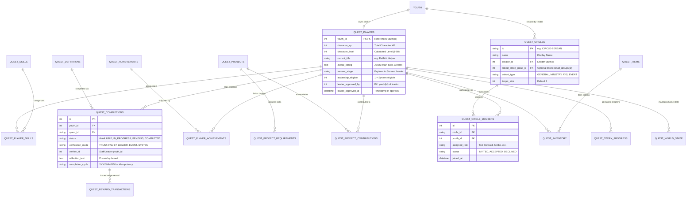

# Koinonia Quest — Data Model Specification (Draft)

**Document Version:** 1.1.0 (Amended per Product Owner Decisions)  
**Phase:** Phase 0.5 (Game Design & Technical Specification)  
**Status:** DRAFT SCHEMA SPECIFICATION ONLY — ZERO MIGRATIONS EXECUTED  
**Target Engine:** SQLite 3 (WAL Mode enabled)  
**Target Database File:** `./fog_community.db`  
**Table Prefix:** `quest_*` (Strict additive isolation)  

---

## 1. Data Modeling Principles & Safeguards

1. **Strict Table Isolation:** All Quest tables are prefixed with `quest_`. Core tables (`youth`, `users`, `events`, `attendance`, `gamification_points`, `point_transactions`, `small_groups`) remain **100% untouched**.
2. **Canonical Foreign Keys:** Quest references player identity strictly through `youth.id` (`youth_id INTEGER NOT NULL REFERENCES youth(id)`).
3. **Zero Profile Duplication:** Quest **never stores duplicate personal data** (no copies of emails, real phone numbers, parent names, or baptism records). All display names and avatars resolve dynamically via the canonical session identity.
4. **Human Leadership Validation:** The schema separates automated *eligibility* calculation from explicit human *pastoral approval* for servant leadership tiers.
5. **Quest Circles Governance:** Tables support leader-directed circle creation, invitation/acceptance workflows, cross-cohort flexibility, and optional linkage to Koinonia `small_groups`.
6. **Reflection Privacy:** Private reflection fields are marked `PRIVATE BY DEFAULT` under the *Reflection Safety Architecture* directive.

---

## 2. Entity Relationship Diagram (ERD)



---

## 3. Detailed Table Schema Definitions (SQLite DDL)

### 3.1 Player Identity & Skills

```sql
-- 1. quest_players
-- Core player profile extending canonical Koinonia youth record.
-- Supports human pastoral approval for Apprentice and Servant Leader stages.
CREATE TABLE IF NOT EXISTS quest_players (
    youth_id INTEGER PRIMARY KEY,
    character_xp INTEGER NOT NULL DEFAULT 0 CHECK (character_xp >= 0),
    character_level INTEGER NOT NULL DEFAULT 1 CHECK (character_level >= 1),
    current_title TEXT NOT NULL DEFAULT 'Novice Pilgrim',
    avatar_config TEXT NOT NULL DEFAULT '{"skinTone":1,"hairStyle":"default","hairColor":"black","outfit":"casual","accessory":"none"}',
    servant_stage TEXT NOT NULL DEFAULT 'Explorer' CHECK (servant_stage IN ('Explorer','Contributor','Helper','Team Steward','Apprentice Leader','Servant Leader')),
    leadership_eligible INTEGER NOT NULL DEFAULT 0 CHECK (leadership_eligible IN (0, 1)),
    leader_approved_by INTEGER, -- youth.id of approving pastor/mentor
    leader_approved_at DATETIME,
    sound_enabled INTEGER NOT NULL DEFAULT 1 CHECK (sound_enabled IN (0, 1)),
    created_at DATETIME NOT NULL,
    updated_at DATETIME NOT NULL,
    FOREIGN KEY (youth_id) REFERENCES youth(id) ON DELETE CASCADE,
    FOREIGN KEY (leader_approved_by) REFERENCES youth(id)
);

CREATE INDEX IF NOT EXISTS idx_quest_players_level ON quest_players(character_level);
CREATE INDEX IF NOT EXISTS idx_quest_players_stage ON quest_players(servant_stage);

-- 2. quest_skills
-- Master lookup catalog for the 10 Christian Formation skills.
CREATE TABLE IF NOT EXISTS quest_skills (
    id TEXT PRIMARY KEY, -- 'COMPASSION', 'TEAMWORK', 'STEWARDSHIP', etc.
    name TEXT NOT NULL UNIQUE,
    description TEXT NOT NULL,
    icon_slug TEXT NOT NULL,
    sort_order INTEGER NOT NULL DEFAULT 0
);

-- 3. quest_player_skills
-- Radar matrix progression: individual XP per skill for each player.
CREATE TABLE IF NOT EXISTS quest_player_skills (
    id INTEGER PRIMARY KEY AUTOINCREMENT,
    youth_id INTEGER NOT NULL,
    skill_id TEXT NOT NULL,
    xp_amount INTEGER NOT NULL DEFAULT 0 CHECK (xp_amount >= 0),
    skill_level INTEGER NOT NULL DEFAULT 1 CHECK (skill_level >= 1),
    updated_at DATETIME NOT NULL,
    FOREIGN KEY (youth_id) REFERENCES youth(id) ON DELETE CASCADE,
    FOREIGN KEY (skill_id) REFERENCES quest_skills(id),
    UNIQUE(youth_id, skill_id)
);

CREATE INDEX IF NOT EXISTS idx_quest_player_skills_user ON quest_player_skills(youth_id);
```

---

### 3.2 Quest Circles (Small Groups & Teams)

```sql
-- 4. quest_circles
-- Small group cohorts (target size: 5–8 youth).
-- Governed by leader/admin creation; optional linkage to Koinonia small_groups.
CREATE TABLE IF NOT EXISTS quest_circles (
    id TEXT PRIMARY KEY, -- e.g. 'CIR-001'
    name TEXT NOT NULL,
    creator_id INTEGER NOT NULL, -- youth.id of the creating leader/admin
    linked_small_group_id INTEGER, -- Optional foreign key to core small_groups(id)
    cohort_type TEXT NOT NULL DEFAULT 'GENERAL' CHECK (cohort_type IN ('GENERAL','MINISTRY','AYS','EVENT','SEASONAL')),
    target_size INTEGER NOT NULL DEFAULT 8 CHECK (target_size BETWEEN 3 AND 12),
    is_active INTEGER NOT NULL DEFAULT 1 CHECK (is_active IN (0, 1)),
    created_at DATETIME NOT NULL,
    updated_at DATETIME NOT NULL,
    FOREIGN KEY (creator_id) REFERENCES youth(id),
    FOREIGN KEY (linked_small_group_id) REFERENCES small_groups(id)
);

CREATE INDEX IF NOT EXISTS idx_quest_circles_creator ON quest_circles(creator_id);
CREATE INDEX IF NOT EXISTS idx_quest_circles_linked ON quest_circles(linked_small_group_id);

-- 5. quest_circle_members
-- Circle participation, invitation status, and asymmetric quest roles.
CREATE TABLE IF NOT EXISTS quest_circle_members (
    id INTEGER PRIMARY KEY AUTOINCREMENT,
    circle_id TEXT NOT NULL,
    youth_id INTEGER NOT NULL,
    assigned_role TEXT DEFAULT 'Member', -- 'Tool Steward', 'Water Bearer', 'Scribe', etc.
    status TEXT NOT NULL DEFAULT 'INVITED' CHECK (status IN ('INVITED','ACCEPTED','DECLINED','REMOVED')),
    invited_at DATETIME NOT NULL,
    joined_at DATETIME,
    FOREIGN KEY (circle_id) REFERENCES quest_circles(id) ON DELETE CASCADE,
    FOREIGN KEY (youth_id) REFERENCES youth(id) ON DELETE CASCADE,
    UNIQUE(circle_id, youth_id)
);

CREATE INDEX IF NOT EXISTS idx_quest_circle_members_user ON quest_circle_members(youth_id, status);
```

---

### 3.3 Quests, Progress & Completions

```sql
-- 6. quest_definitions
-- Master quest catalog holding the 30+ quests and future episodic content.
CREATE TABLE IF NOT EXISTS quest_definitions (
    id TEXT PRIMARY KEY, -- e.g. 'Q-001'
    name TEXT NOT NULL,
    category TEXT NOT NULL CHECK (category IN ('HOME','FAMILY','PERSONAL','COMMUNITY','TEAMWORK','SERVICE','FITNESS','CREATIVITY','LEADERSHIP','REFLECTION')),
    description TEXT NOT NULL,
    real_world_action TEXT NOT NULL,
    stewardship_fallback TEXT, -- Specific home stewardship fallback (e.g. pet water, shared table)
    difficulty TEXT NOT NULL DEFAULT 'Simple' CHECK (difficulty IN ('Simple','Moderate','Challenging')),
    verification_type TEXT NOT NULL CHECK (verification_type IN ('TRUST','FAMILY','LEADER','EVENT','SYSTEM')),
    reward_life_points INTEGER NOT NULL DEFAULT 0 CHECK (reward_life_points >= 0),
    reward_character_xp INTEGER NOT NULL DEFAULT 0 CHECK (reward_character_xp >= 0),
    reward_skills TEXT NOT NULL DEFAULT '[]', -- JSON: [{"skillId":"STEWARDSHIP","xp":15}]
    community_project_id TEXT, -- Optional link to shared community project (e.g. 'PRJ-001')
    community_project_xp INTEGER NOT NULL DEFAULT 0,
    is_repeatable INTEGER NOT NULL DEFAULT 0 CHECK (is_repeatable IN (0, 1)),
    cooldown_hours INTEGER NOT NULL DEFAULT 24,
    min_character_level INTEGER NOT NULL DEFAULT 1,
    prerequisite_quest_id TEXT,
    reflection_prompt TEXT,
    story_hook TEXT,
    is_active INTEGER NOT NULL DEFAULT 1 CHECK (is_active IN (0, 1)),
    FOREIGN KEY (community_project_id) REFERENCES quest_projects(id),
    FOREIGN KEY (prerequisite_quest_id) REFERENCES quest_definitions(id)
);

CREATE INDEX IF NOT EXISTS idx_quest_def_cat ON quest_definitions(category, is_active);

-- 7. quest_completions
-- Tracks live lifecycle of quest attempts.
-- NOTE: reflection_text is strictly PRIVATE BY DEFAULT under the Reflection Safety Architecture.
CREATE TABLE IF NOT EXISTS quest_completions (
    id INTEGER PRIMARY KEY AUTOINCREMENT,
    youth_id INTEGER NOT NULL,
    quest_id TEXT NOT NULL,
    status TEXT NOT NULL DEFAULT 'AVAILABLE' CHECK (status IN ('AVAILABLE','IN_PROGRESS','PENDING_VERIFICATION','COMPLETED','REJECTED')),
    verification_mode TEXT NOT NULL CHECK (verification_mode IN ('TRUST','FAMILY','LEADER','EVENT','SYSTEM')),
    verifier_id INTEGER, -- youth.id of approving leader (or NULL for TRUST / FAMILY direct handover)
    reflection_text TEXT, -- Private by default; no automated scanning without independent review
    proof_notes TEXT,
    rejection_reason TEXT,
    completion_cycle TEXT NOT NULL DEFAULT 'ONE_TIME', -- 'YYYY-MM-DD' for daily quests; enforces idempotency
    started_at DATETIME NOT NULL,
    completed_at DATETIME,
    created_at DATETIME NOT NULL,
    FOREIGN KEY (youth_id) REFERENCES youth(id) ON DELETE CASCADE,
    FOREIGN KEY (quest_id) REFERENCES quest_definitions(id),
    FOREIGN KEY (verifier_id) REFERENCES youth(id),
    UNIQUE(youth_id, quest_id, completion_cycle)
);

CREATE INDEX IF NOT EXISTS idx_quest_comp_user ON quest_completions(youth_id, status);
CREATE INDEX IF NOT EXISTS idx_quest_comp_pending ON quest_completions(status, verification_mode);
CREATE INDEX IF NOT EXISTS idx_quest_comp_cycle ON quest_completions(youth_id, quest_id, completion_cycle);
```

---

### 3.4 Financial-Grade Reward Ledger

```sql
-- 8. quest_rewards
-- Declarative reward definitions attached to specific quest milestones.
CREATE TABLE IF NOT EXISTS quest_rewards (
    id TEXT PRIMARY KEY,
    quest_id TEXT NOT NULL,
    reward_type TEXT NOT NULL CHECK (reward_type IN ('LIFE_POINTS','CHAR_XP','SKILL_XP','ITEM','TITLE','BADGE')),
    target_identifier TEXT,
    amount INTEGER NOT NULL DEFAULT 1,
    FOREIGN KEY (quest_id) REFERENCES quest_definitions(id) ON DELETE CASCADE
);

-- 9. quest_reward_transactions
-- Immutable audit ledger recording every point issuance. Guarantees 100% idempotency.
CREATE TABLE IF NOT EXISTS quest_reward_transactions (
    tx_id TEXT PRIMARY KEY, -- Formatted: 'TX-Q-{completion_id}-{timestamp}'
    completion_id INTEGER NOT NULL,
    youth_id INTEGER NOT NULL,
    life_points_awarded INTEGER NOT NULL DEFAULT 0,
    character_xp_awarded INTEGER NOT NULL DEFAULT 0,
    skill_xp_snapshot TEXT NOT NULL DEFAULT '{}',
    koinonia_pt_synced INTEGER NOT NULL DEFAULT 0 CHECK (koinonia_pt_synced IN (0, 1)),
    created_at DATETIME NOT NULL,
    FOREIGN KEY (completion_id) REFERENCES quest_completions(id) ON DELETE CASCADE,
    FOREIGN KEY (youth_id) REFERENCES youth(id) ON DELETE CASCADE,
    UNIQUE(completion_id)
);

CREATE INDEX IF NOT EXISTS idx_quest_reward_tx_user ON quest_reward_transactions(youth_id);
```

---

### 3.5 Achievements & Titles

```sql
-- 10. quest_achievements
-- Master catalog of non-competitive badges and milestone recognitions.
CREATE TABLE IF NOT EXISTS quest_achievements (
    id TEXT PRIMARY KEY, -- e.g. 'ACH-01'
    name TEXT NOT NULL UNIQUE,
    category TEXT NOT NULL,
    description TEXT NOT NULL,
    icon_slug TEXT NOT NULL,
    reward_title TEXT,
    reward_life_points INTEGER NOT NULL DEFAULT 0,
    reward_item_id TEXT,
    sort_order INTEGER NOT NULL DEFAULT 0
);

-- 11. quest_player_achievements
-- Badges and achievements unlocked by players.
CREATE TABLE IF NOT EXISTS quest_player_achievements (
    id INTEGER PRIMARY KEY AUTOINCREMENT,
    youth_id INTEGER NOT NULL,
    achievement_id TEXT NOT NULL,
    unlocked_at DATETIME NOT NULL,
    FOREIGN KEY (youth_id) REFERENCES youth(id) ON DELETE CASCADE,
    FOREIGN KEY (achievement_id) REFERENCES quest_achievements(id) ON DELETE CASCADE,
    UNIQUE(youth_id, achievement_id)
);

CREATE INDEX IF NOT EXISTS idx_quest_player_ach ON quest_player_achievements(youth_id);
```

---

### 3.6 Shared Community Projects

```sql
-- 12. quest_projects
-- Shared collective projects (e.g. Restore Community Garden).
CREATE TABLE IF NOT EXISTS quest_projects (
    id TEXT PRIMARY KEY, -- e.g. 'PRJ-001'
    title TEXT NOT NULL,
    description TEXT NOT NULL,
    current_stage INTEGER NOT NULL DEFAULT 0 CHECK (current_stage >= 0),
    total_stages INTEGER NOT NULL DEFAULT 5,
    status TEXT NOT NULL DEFAULT 'ACTIVE' CHECK (status IN ('ACTIVE','COMPLETED','PAUSED')),
    created_at DATETIME NOT NULL,
    updated_at DATETIME NOT NULL
);

-- 13. quest_project_requirements
-- Skill XP thresholds required per stage for community projects.
CREATE TABLE IF NOT EXISTS quest_project_requirements (
    id INTEGER PRIMARY KEY AUTOINCREMENT,
    project_id TEXT NOT NULL,
    stage_number INTEGER NOT NULL,
    skill_id TEXT NOT NULL,
    target_xp INTEGER NOT NULL CHECK (target_xp > 0),
    current_xp INTEGER NOT NULL DEFAULT 0 CHECK (current_xp >= 0),
    stage_name TEXT NOT NULL,
    FOREIGN KEY (project_id) REFERENCES quest_projects(id) ON DELETE CASCADE,
    FOREIGN KEY (skill_id) REFERENCES quest_skills(id),
    UNIQUE(project_id, stage_number, skill_id)
);

CREATE INDEX IF NOT EXISTS idx_quest_proj_req ON quest_project_requirements(project_id, stage_number);

-- 14. quest_project_contributions
-- Immutable ledger recording every individual youth contribution to a project.
CREATE TABLE IF NOT EXISTS quest_project_contributions (
    id INTEGER PRIMARY KEY AUTOINCREMENT,
    project_id TEXT NOT NULL,
    youth_id INTEGER NOT NULL,
    quest_id TEXT NOT NULL,
    skill_id TEXT NOT NULL,
    xp_contributed INTEGER NOT NULL CHECK (xp_contributed > 0),
    created_at DATETIME NOT NULL,
    FOREIGN KEY (project_id) REFERENCES quest_projects(id) ON DELETE CASCADE,
    FOREIGN KEY (youth_id) REFERENCES youth(id) ON DELETE CASCADE,
    FOREIGN KEY (quest_id) REFERENCES quest_definitions(id),
    FOREIGN KEY (skill_id) REFERENCES quest_skills(id)
);

CREATE INDEX IF NOT EXISTS idx_quest_proj_contrib ON quest_project_contributions(project_id, youth_id);
```

---

### 3.7 Story, Inventory & Virtual World State

```sql
-- 15. quest_story_progress
-- Tracks narrative story campaign and Alpha Youth Series (AYS) chapter progress.
CREATE TABLE IF NOT EXISTS quest_story_progress (
    id INTEGER PRIMARY KEY AUTOINCREMENT,
    youth_id INTEGER NOT NULL,
    campaign_id TEXT NOT NULL, -- e.g. 'AYS_SEASON_1'
    chapter_number INTEGER NOT NULL DEFAULT 1,
    status TEXT NOT NULL DEFAULT 'IN_PROGRESS' CHECK (status IN ('LOCKED','IN_PROGRESS','COMPLETED')),
    reflection_notes TEXT, -- Private by default
    completed_at DATETIME,
    updated_at DATETIME NOT NULL,
    FOREIGN KEY (youth_id) REFERENCES youth(id) ON DELETE CASCADE,
    UNIQUE(youth_id, campaign_id, chapter_number)
);

CREATE INDEX IF NOT EXISTS idx_quest_story ON quest_story_progress(youth_id, campaign_id);

-- 16. quest_items
-- Catalog of aesthetic items, furniture, tools, and clothing cosmetics.
CREATE TABLE IF NOT EXISTS quest_items (
    id TEXT PRIMARY KEY, -- e.g. 'ITEM-STRAW-HAT'
    name TEXT NOT NULL,
    category TEXT NOT NULL CHECK (category IN ('COSMETIC','FURNITURE','TOOL','BADGE_PROP')),
    description TEXT NOT NULL,
    asset_slug TEXT NOT NULL,
    is_tradable INTEGER NOT NULL DEFAULT 0
);

-- 17. quest_inventory
-- Items and decorations owned by players.
CREATE TABLE IF NOT EXISTS quest_inventory (
    id INTEGER PRIMARY KEY AUTOINCREMENT,
    youth_id INTEGER NOT NULL,
    item_id TEXT NOT NULL,
    quantity INTEGER NOT NULL DEFAULT 1,
    is_equipped INTEGER NOT NULL DEFAULT 0 CHECK (is_equipped IN (0, 1)),
    acquired_at DATETIME NOT NULL,
    FOREIGN KEY (youth_id) REFERENCES youth(id) ON DELETE CASCADE,
    FOREIGN KEY (item_id) REFERENCES quest_items(id),
    UNIQUE(youth_id, item_id)
);

CREATE INDEX IF NOT EXISTS idx_quest_inv_user ON quest_inventory(youth_id);

-- 18. quest_world_state
-- Tracks persistent cosmetic state of player's Home and personal room.
CREATE TABLE IF NOT EXISTS quest_world_state (
    youth_id INTEGER PRIMARY KEY,
    home_cleanliness_level INTEGER NOT NULL DEFAULT 1 CHECK (home_cleanliness_level BETWEEN 1 AND 5),
    garden_growth_stage INTEGER NOT NULL DEFAULT 0 CHECK (garden_growth_stage BETWEEN 0 AND 5),
    furniture_layout TEXT NOT NULL DEFAULT '{}',
    unlocked_rooms TEXT NOT NULL DEFAULT '["bedroom","garden"]',
    updated_at DATETIME NOT NULL,
    FOREIGN KEY (youth_id) REFERENCES youth(id) ON DELETE CASCADE
);
```
